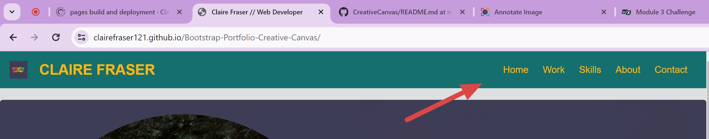
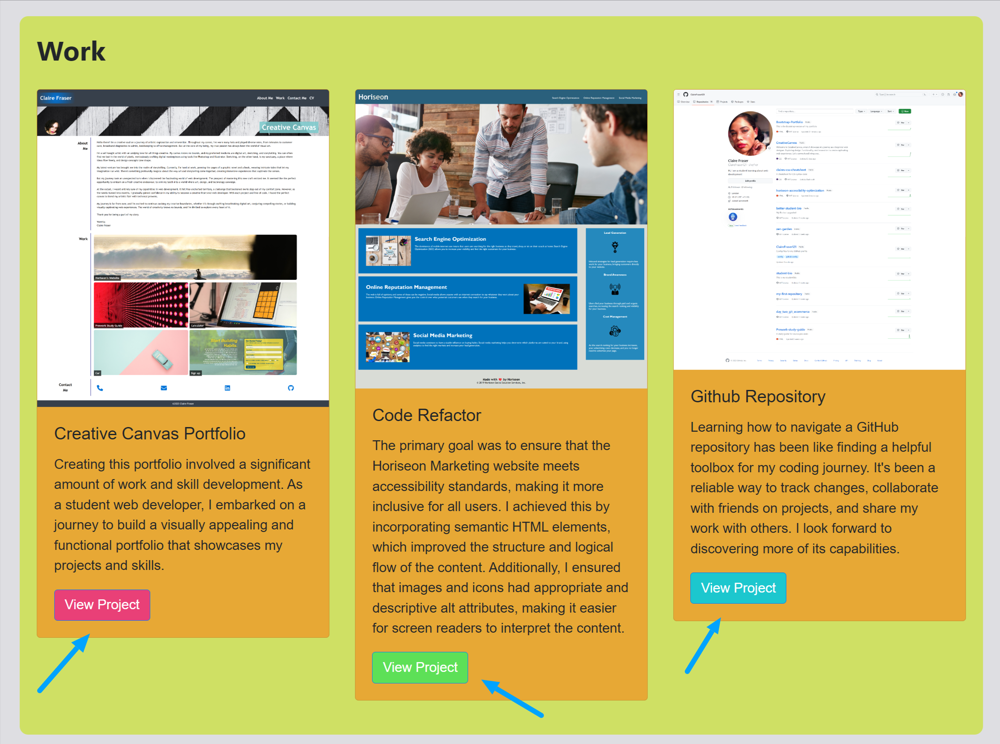
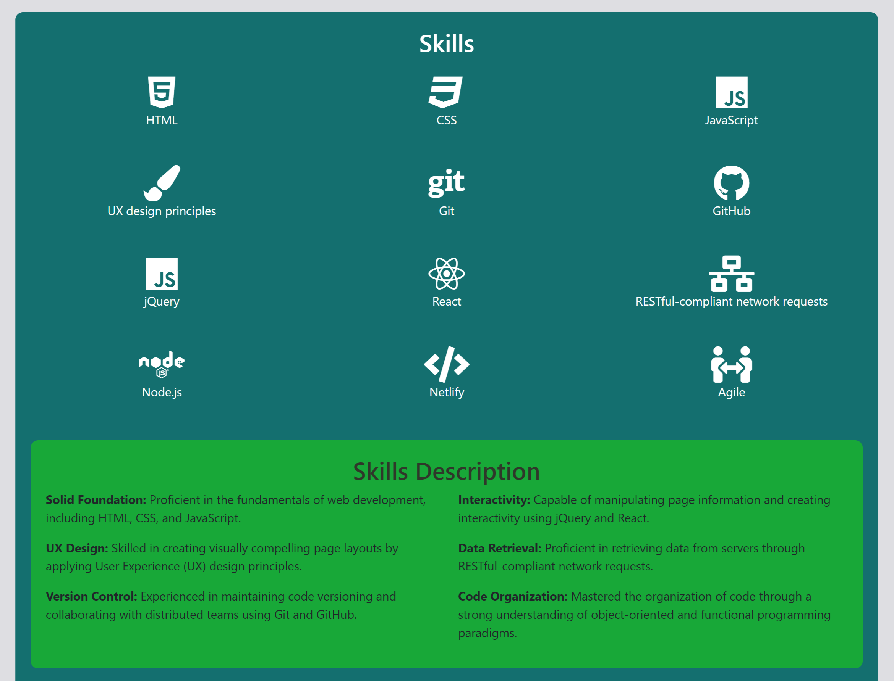
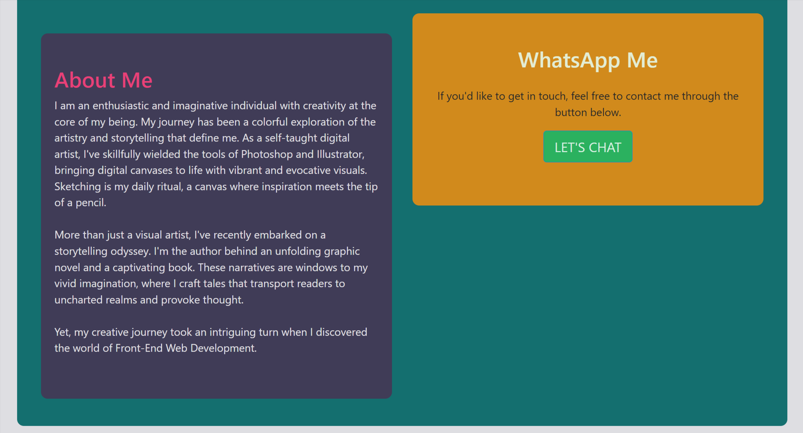

# Bootstrap Portfolio

Welcome to my Bootstrap-powered portfolio webpage! This project is part of an assignment that focuses on creating a portfolio layout using the Bootstrap CSS Framework from scratch. It showcases my skills in HTML, CSS, GitHub, GitHub Pages, and Bootstrap.

## Introduction

In this assignment, I've used Bootstrap to create a professional and visually appealing portfolio website. This webpage serves as a platform to display my work, skills, and provide information about myself. As I continue my journey in web development, this portfolio will evolve to showcase my progress and future projects.

## Description

### UX and Advanced CSS

Throughout this project, I have learned a wide range of web development skills, including HTML, CSS, GitHub, GitHub Pages, and Bootstrap. It's a culmination of knowledge and practice that enables me to create a user-friendly and responsive portfolio. The use of Bootstrap has allowed me to enhance the site's design and layout efficiently.

### Commitment to Learning

An essential aspect of this assignment has been an emphasis on maintaining a healthy commit history on GitHub. Committing often has not only ensured that my work is saved but also reflects my active engagement in learning and coding. Considering the principle of "commit early and often" to track code progression and provide an opportunity to revert if needed.

### Instructions

Here's a summary of the steps taken to complete this project:

1. Created a new GitHub repository named **Bootstrap-Portfolio**.
2. Cloned the repository to my computer.
3. Structured the project with the following elements:
    - `index.html`
    - `CSS` folder with `style.css`
    - `images` folder for all project images
4. Utilized Bootstrap to design the portfolio, which includes:
    - A navigation bar with links to portfolio sections.
    - A hero section featuring a jumbotron with a picture and personal information.
    - A work section that showcases projects with descriptions.
    - A skills section listing the skills I expect to learn.
    - An about/contact section that provides an introduction and contact information.
    - A footer with hyperlinks and hover effects on buttons.
5. Minimized the use of media queries by using Bootstrap's responsive features.
6. Deployed the portfolio to GitHub Pages to make it accessible online.

I'm excited to share my web development journey through this portfolio and am looking forward to the upcoming units, where we'll delve into JavaScript to further enhance my coding skills.

## Table of Contents

* [Installation](#installation)
* [Usage](#usage)
* [Credits](#credits)
* [License](#license)

## Installation

### Exploring the Portfolio

To explore this Bootstrap-powered portfolio, follow these steps:

1. **Visit the Website:** Open your web browser and go to the following URL:

   [Claire Fraser's Portfolio](https://clairefraser121.github.io/Bootstrap-Portfolio-Creative-Canvas/)

2. **Navigate Through Sections:** Once on the website, you can scroll down to explore different sections, including the navigation bar, hero section, work section, skills section, and about/contact section.

Enjoy your visit!

## Usage

### Explore My Portfolio

Welcome to my portfolio! It's designed to showcase my web development skills and creative work. Here's how you can explore and navigate through it:

1. **Visit My Portfolio:** To get started, simply open your web browser and go to my portfolio by clicking on the link below:

   [Claire Fraser's Portfolio](https://clairefraser121.github.io/Bootstrap-Portfolio-Creative-Canvas/)

2. **Navigate with Ease:** You'll find a top navigation bar that makes it easy to explore different sections of my portfolio. Click on the section names to quickly jump to specific content, such as the hero section, work section, skills section, and about/contact section.

    
   *Screenshot: The top navigation bar for easy access to different sections.*

3. **Discover My Work:** The "Work" section is where you'll discover a collection of my projects. Each project is showcased with a Bootstrap card, offering a brief overview of the work. Click on the project cards to dive deeper and explore my class project work.

   
   *Screenshot: The "Work" section displaying my projects for your exploration.*

4. **Explore My Skills:** In the "Skills" section, you'll find a list of web development skills that I've acquired during my bootcamp journey. Each skill is accompanied by a relevant icon, giving you insights into my capabilities.

   
   *Screenshot: The "Skills" section that showcases my web development proficiencies.*

5. **Get to Know Me and Contact Me:** The "About Me" section provides a glimpse into my creative journey. Learn about my background as a digital artist and storyteller. Additionally, you can connect with me using the "WhatsApp Me" button for any inquiries or discussions.

   
   *Screenshot: The "About Me" and "Contact" section providing insights and easy communication.*

6. **Footer Section:** The footer section contains contact information and links.

   
   *Screenshot: The footer section with contact information and links.*

Enjoy your journey exploring my portfolio!
